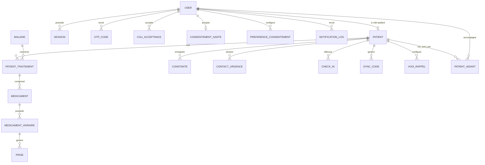

# Modèle de données formel

## Statut de ce document

Ce fichier est un **contrat**. Toute entité, tout champ, toute relation décrits ici doivent exister dans l'implémentation. Un agent qui a besoin d'un champ non listé ici doit **proposer une modification de ce fichier** plutôt que d'ajouter silencieusement un champ dans le code — ce document doit rester la source de vérité à jour, pas une photo figée du jour 1.

Les types indiqués sont **conceptuels** (ex: `UUID`, `string`, `enum`, `timestamp`), pas du SQL — la traduction en type Postgres/SQLAlchemy précis est laissée aux agents backend, en cohérence avec les conventions de `database-neon/SKILL.md`.

---

## Vue d'ensemble des relations

---

## 1. `User` — compte utilisateur (tous rôles)

Voir `auth-onboarding/SKILL.md` pour le flux complet.

| Champ | Type | Contraintes / Notes |
|---|---|---|
| id | UUID | clé primaire |
| email | string | unique, obligatoire |
| phone | string | nullable, renseigné pendant l'onboarding, pas à l'inscription |
| password_hash | string | nullable si compte créé uniquement via Google ; jamais le mot de passe en clair |
| google_sub | string | nullable, **unique** — identifiant stable Google (`sub` du id_token) ; obligatoire si auth Google |
| auth_providers | json / string[] | ex: `["email"]`, `["google"]`, `["email","google"]` — providers liés au compte |
| email_verified_at | timestamp | nullable tant que l'OTP n'est pas validé ; rempli immédiatement pour Google (email vérifié côté Google) |
| role | enum | `patient`, `aidant` (V1) — extensible à `medecin`, `agent_sante_communautaire`, `pharmacien` (V2) |
| onboarding_step | enum/string | étape courante de l'onboarding, permet la reprise (cf. `auth-onboarding`) |
| langue | enum | choisie dès le premier écran, avant l'email |
| fuseau_horaire | string | capturé automatiquement via l'appareil à l'inscription |
| created_at | timestamp | |
| updated_at | timestamp | |
| deleted_at | timestamp | nullable, soft delete (droit à l'oubli) |

---

## 2. `OtpCode`

| Champ | Type | Contraintes / Notes |
|---|---|---|
| id | UUID | |
| user_id | UUID (FK → User) | |
| code_hash | string | jamais le code en clair, hashé comme un mot de passe |
| type | enum | `inscription`, `reset_password` |
| expires_at | timestamp | courte durée (ex: 10 min) |
| used_at | timestamp | nullable, usage unique |
| tentatives | integer | compteur, pour anti brute-force |
| created_at | timestamp | |

---

## 3. `CguAcceptance`

| Champ | Type | Contraintes / Notes |
|---|---|---|
| id | UUID | |
| user_id | UUID (FK → User) | |
| version | string | ex: `v1.0`, les CGU sont versionnées |
| accepted_at | timestamp | |
| ip | string | nullable |

**Obligatoire pour tous les rôles sans exception** (patient, aidant, et rôles V2).

---

## 4. `ConsentementSante`

| Champ | Type | Contraintes / Notes |
|---|---|---|
| id | UUID | |
| user_id | UUID (FK → User) | |
| accepted_at | timestamp | |

Distinct de `CguAcceptance` car il couvre spécifiquement le traitement des données de santé.

---

## 5. `Session` (device)

| Champ | Type | Contraintes / Notes |
|---|---|---|
| id | UUID | |
| user_id | UUID (FK → User) | |
| refresh_token_hash | string | jamais le token en clair |
| device_info | string/json | modèle, OS, identifiant appareil |
| created_at | timestamp | |
| revoked_at | timestamp | nullable |

Un utilisateur peut avoir plusieurs sessions actives (multi-appareils).

---

## 6. `Patient` — extension du `User` quand `role = patient`

| Champ | Type | Contraintes / Notes |
|---|---|---|
| user_id | UUID (FK → User, 1-1) | clé primaire = clé étrangère |
| localisation | string | ville/quartier, utile pour Volet 4 |
| nom_complet | string | |
| date_naissance | date | |
| sexe | enum | |
| photo_url | string | nullable |

---

## 7. `Maladie` — table de référence

| Champ | Type | Contraintes / Notes |
|---|---|---|
| id | UUID | |
| nom | string | |
| description | text | nullable |
| actif | boolean | permet de désactiver une maladie sans la supprimer |

Gérée côté backend, enrichissable sans nouvelle version de l'app mobile.

---

## 8. `PatientTraitement`

| Champ | Type | Contraintes / Notes |
|---|---|---|
| id | UUID | |
| patient_id | UUID (FK → Patient) | |
| maladie_id | UUID (FK → Maladie) | |
| phase | enum | `debut`, `en_cours`, `maintenance`, `inconnu` |
| date_debut | date | nullable, optionnel |
| created_at | timestamp | |

Un patient peut avoir plusieurs traitements actifs simultanément (plusieurs maladies).

---

## 9. `Medicament`

| Champ | Type | Contraintes / Notes |
|---|---|---|
| id | UUID | |
| patient_traitement_id | UUID (FK → PatientTraitement) | |
| nom | string | |
| dosage | string | |
| forme | enum | comprimé, sirop, injection, etc. |
| stock_restant | integer | nullable |
| seuil_alerte_stock | integer | nullable, déclenche une alerte de renouvellement |
| created_at | timestamp | |

---

## 10. `MedicamentHoraire`

| Champ | Type | Contraintes / Notes |
|---|---|---|
| id | UUID | |
| medicament_id | UUID (FK → Medicament) | |
| heure | time | ex: `08:00` |
| jours | string/json | jours de la semaine concernés, ou "tous les jours" |
| actif | boolean | permet de suspendre un horaire sans le supprimer |

Un médicament peut avoir plusieurs horaires de prise par jour.

---

## 11. `Prise`

| Champ | Type | Contraintes / Notes |
|---|---|---|
| id | UUID | |
| medicament_horaire_id | UUID (FK → MedicamentHoraire) | |
| heure_prevue | timestamp | date + heure exacte prévue |
| statut | enum | `confirmee`, `manquee`, `en_attente` |
| confirmee_at | timestamp | nullable |
| canal | enum | `app`, `sms` — pour le fallback du Volet 4 |
| created_at | timestamp | |

Une ligne `Prise` est générée à chaque échéance prévue par `MedicamentHoraire` (via job planifié ou génération à la volée).

---

## 12. `Constante`

| Champ | Type | Contraintes / Notes |
|---|---|---|
| id | UUID | |
| patient_id | UUID (FK → Patient) | |
| type | enum | `poids`, `tension`, `temperature`, `glycemie`, `humeur`, `sommeil`, extensible |
| valeur | decimal/string | selon le type (tension = deux valeurs, à structurer en JSON si besoin) |
| unite | string | |
| mesure_at | timestamp | |
| source | enum | `manuel`, `objet_connecte` |

---

## 13. `PatientAidant` — relation many-to-many

| Champ | Type | Contraintes / Notes |
|---|---|---|
| id | UUID | |
| patient_id | UUID (FK → Patient) | |
| aidant_id | UUID (FK → User, role=aidant) | |
| statut | enum | `actif`, `revoque` |
| niveau_permission | json | ex: `{"observance": true, "constantes": false}` |
| created_at | timestamp | |
| revoked_at | timestamp | nullable |

Un patient peut avoir plusieurs aidants, un aidant peut suivre plusieurs patients.

---

## 14. `SyncCode`

| Champ | Type | Contraintes / Notes |
|---|---|---|
| id | UUID | |
| patient_id | UUID (FK → Patient) | |
| code | string | affiché en clair côté app patient + encodé en QR |
| expires_at | timestamp | courte durée (ex: 10 min) |
| used_at | timestamp | nullable, usage unique |

---

## 15. `ContactUrgence`

| Champ | Type | Contraintes / Notes |
|---|---|---|
| id | UUID | |
| patient_id | UUID (FK → Patient) | |
| nom | string | |
| telephone | string | |
| relation | string | ex: "fils", "voisin" |

Utilisé par le bouton SOS et l'escalade du Volet 1/3.

---

## 16. `CheckIn`

| Champ | Type | Contraintes / Notes |
|---|---|---|
| id | UUID | |
| patient_id | UUID (FK → Patient) | |
| date | date | |
| statut | enum | `ca_va`, `pas_top`, `sans_reponse` |
| created_at | timestamp | |

Un check-in par jour et par patient.

---

## 17. `VoixRappel`

| Champ | Type | Contraintes / Notes |
|---|---|---|
| id | UUID | |
| patient_id | UUID (FK → Patient) | |
| type | enum | `systeme`, `personnalisee` |
| fichier_audio_url | string | nullable si `systeme` |
| enregistree_par | UUID (FK → User) | nullable, l'aidant qui a enregistré le message |
| created_at | timestamp | |

---

## 18. `PreferenceConsentement` — brique du moteur Volet 7

| Champ | Type | Contraintes / Notes |
|---|---|---|
| id | UUID | |
| user_id | UUID (FK → User) | |
| type_alerte | string | ex: `contact_medecin_tension`, `alerte_checkin_absence` |
| toujours_demander | boolean | si true, jamais d'action auto, on repropose systématiquement |
| regle_auto | json | nullable, ex: `{"delai_heures": 48}` — la seule exception au consentement systématique, définie explicitement par l'utilisateur |
| created_at | timestamp | |
| updated_at | timestamp | |

---

## 19. `NotificationLog` — journal d'audit, obligatoire pour toute alerte

| Champ | Type | Contraintes / Notes |
|---|---|---|
| id | UUID | |
| destinataire_id | UUID (FK → User) | |
| type | string | |
| contenu | text | le message effectivement envoyé |
| declencheur | json | donnée/événement à l'origine de la notification |
| envoye_at | timestamp | |

Aucune fonctionnalité de notification/alerte ne doit être considérée terminée si elle n'écrit pas dans `NotificationLog`.

---

## Règles transverses (à respecter par tout agent, quelle que soit l'entité codée)

1. Toute entité liée à un `User` de rôle `patient` doit passer par `Patient`, pas directement par `User` — garde la séparation claire entre compte (auth) et profil patient (métier).
2. Aucune table de donnée de santé ou de notification ne doit être créée sans qu'un mécanisme de consentement (`PreferenceConsentement`) ou de journalisation (`NotificationLog`) soit prévu si elle déclenche une alerte vers un tiers.
3. Toute suppression de donnée patient doit respecter le soft delete par défaut (`deleted_at`), sauf demande explicite de suppression définitive.
4. Si un agent a besoin d'un champ ou d'une entité non listés ici, il modifie ce fichier en premier, puis code — jamais l'inverse.
